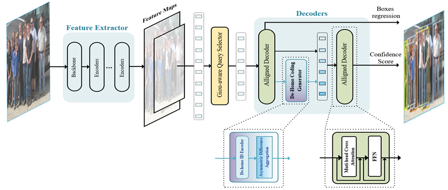

## DH-DETR: De-Homogenized Queries DETR in Crowded Scenes (Deformable-DETR implementation)


## Introduction
This paper focuses on improving dense object detection, a crucial task in fields like self-driving cars and video 
surveillance. Detectors using Non-Maximum Suppression (NMS) for post-processing often produce 
duplicate predictions or miss objects in crowded scenes. Although 
end-to-end detectors like DETR can integrate NMS-like deduplication into the network, we've noticed that homogenized 
queries in these query-based detectors can reduce the learning efficiency of encoding, leading to deduplication predictions.
To address this problem, we introduce a learnable differential encoding mechanism to de-homogenize queries and enable
better communication among queries, replacing the previous self-attention layers. Additionally, we employ a GIOU-aware
loss considering both position and confidence predictions for higher-quality query initialization. On the challenging 
[CrowdHuman]() dataset, our method achieves outstanding results with 8% parameters lower compared to Deformable DETR: 
an average precision (AP) of 93.6%, MR^-2 of 39.2%, and Jaccard Index (JI) of 84.3%. This outperforms previous 
state-of-the-art methods, such as Iter-E2EDet (Progressive End-to-End Object Detection) and MIP (One proposal, 
multiple predictions). Furthermore, our approach shows high robustness to the crowdedness in a scene.


[//]: # (### Links)

[//]: # (- Iter Sparse R-CNN [[repo]&#40;https://github.com/megvii-research/Iter-E2EDET&#41;])


## Models

Experiments of different methods were conducted on CrowdHuman. All approaches take R-50 as the backbone.
Method | #queries | AP | MR | JI | Param
:--- |:---:|:---:|:---:|:---:|:---:
CrowdDet [[paper](https://openaccess.thecvf.com/content_CVPR_2020/papers/Chu_Detection_in_Crowded_Scenes_One_Proposal_Multiple_Predictions_CVPR_2020_paper.pdf)] | -- | 90.7 | 41.4 | 82.4
Sparse RCNN | 500 | 90.7 | 44.7 | 81.4 |
Deformable DETR | 1000 | 91.3 | 43.8 | 83.3 | 37.7M
Iter-E2EDet | 1000 | 92.1 | 41.5 | 84.0 | 38.0M
Deformable DETR + Ours (6-3) | 1000 | **93.6** | **39.2** | **84.3**  | 34.6M
Deformable DETR + Ours (6-3(2)))| 1000 | 93.5 | 39.3 | 84.1 | 33.7M

X-Y (Z) represents training with X Encoder and Y Decoder , and testing with Z decoders. other methods default to 6-6

## Installation
The codebases are built on top of [Deformable-DETR](https://github.com/fundamentalvision/Deformable-DETR) and [Iter-E2EDET](https://github.com/megvii-research/Iter-E2EDET).

#### Steps
1. Install and build libs following [Deformable-DETR](https://github.com/fundamentalvision/Deformable-DETR).

2. Load the CrowdHuman images from [here](https://www.crowdhuman.org/download.html) and its annotations from [here](https://drive.google.com/file/d/11TKQWUNDf63FbjLHU9iEASm2nE7exgF8/view?usp=sharing). Then update the directory path of the CrowdHuman dataset in the config.py.

3. Train Iter Deformable-DETR
```bash
bash exps/aps.sh
```
or for Swin-L backbone:
```bash
wget https://github.com/SwinTransformer/storage/releases/download/v1.0.0/swin_large_patch4_window7_224_22k.pth
bash exps/aps_swinl.sh
```

4. Evaluate Iter Deformable-DETR. You can download the pre-trained model from [here](https://pan.baidu.com/s/1RrZACC2FI4NGfMluTVgXVQ 
) (coding：1111) for direct evaluation. 
```bash
# checkpoint path: ./output/model_dump/aps/checkpoint-49.pth
bash exps/aps_test.sh 49

